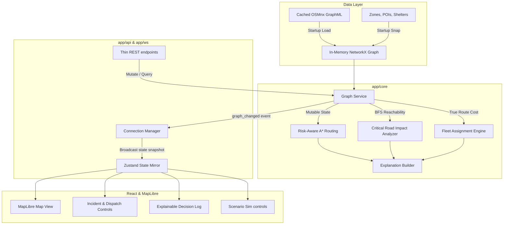

# 🌊 ResQOS — Emergency Response Decision Engine

[](https://opensource.org/licenses/MIT)
[](https://www.python.org/)
[](https://react.dev/)
[](https://fastapi.tiangolo.com/)
[](https://pytest.org/)

> **Coastal Innovation Hackathon · Problem Statement 1 (Flood-Aware Evacuation Routing)**
>
> ResQOS is a next-generation **Emergency Response Decision Support Platform** designed for local Emergency Operations Centers (EOC) during extreme monsoon events. Unlike a consumer navigation app, it models the road network as a *dynamic, semantic graph* that updates in real-time, analyzes cascade infrastructure failures, optimizes emergency fleet routing by true operational cost, and explains its reasoning in plain language.

<div align="center">
  <video src="Video/Recording 2026-07-12 122056.mp4" width="100%" controls autoplay loop muted></video>
  <p><em>ResQOS in Action: Real-time decision support, risk-aware routing, impact analysis, and fleet dispatch simulation.</em></p>
</div>

---

## 🏆 Why ResQOS Wins (The Hackathon Competitive Edge)

Most hackathon entries build simple wrappers around static routing APIs (like Google Maps or Mapbox). ResQOS stands apart by addressing the **unsolved research gaps** in real-world disaster management:

1. **Dynamic in-place graph mutation (No Preprocessing Lag)**: Standard routers (OSRM, GraphHopper) pre-process graphs using Contraction Hierarchies, meaning they cannot ingest live, arbitrary road closures or depth changes without hours of recomputation. ResQOS mutates weights in-memory in $<10\text{ms}$.
2. **Composite Risk-Aware Cost Modeling**: Flooding isn't binary (open/closed). Standard engines route vehicles based on distance or time alone. ResQOS calculates edge cost dynamically:
   $$\text{Operational Cost} = \text{Travel Time} \times \text{Flood Multiplier(depth)} \times \text{Critical Road Multiplier}$$
   If flood depth exceeds a vehicle's impassable threshold (e.g., $30\text{cm}$), the edge cost becomes infinite, automatically forcing rerouting.
3. **The "WOW" Feature — Critical Road Impact Analyzer**: Clicking or flooding any road instantly triggers a cascade impact evaluation:
   * **Isolation Detection**: Which residential zones or hospitals are completely cut off.
   * **Resilience Index**: A population-weighted network connectivity metric that measures overall city safety.
   * **What-If Mode**: Allows commanders to preview the impact of closing a key road or bridge *before* committing the order.
4. **Context-Aware Fleet Dispatch**: Routes emergency vehicles based on *true path cost under live flood conditions*, not straight-line distance. The engine automatically handles backup routing and mid-route mission reassignments if a road floods while a unit is en route.
5. **Explainable Decision Engine**: Replaces opaque polylines with natural-language justifications in the EOC feed (e.g., *"Ambulance A rejected — its only approach crosses Netravati bridge, now at 45cm depth. Ambulance B selected (ETA +4m, risk -62%)"*).
6. **Inclusivity & Evacuation Mapping**: Maps safe assembly points and hospitals, continuously routing isolated populations to the nearest currently-reachable shelter.

---

## 📐 System Architecture

ResQOS is built on a clean, decoupled, in-memory architecture designed for maximum performance, robustness, and offline capabilities.



---

## 🛠️ Code Map (Where Judges Should Look)

The codebase strictly separates algorithmic logic from API frameworks to ensure determinism and unit-testability.

### 🧠 Core Algorithmic Logic (Pure Python, Zero External Dependencies)
* [graph_service.py](file:///c:/Users/ASUS/OneDrive/Pictures/Music/New%20folder/Sahyadri/backend/app/core/graph_service.py): Manages loading, caching, enrichment, snapping coordinates to nodes, in-memory updates, and delta-snapshot generation.
* [routing.py](file:///c:/Users/ASUS/OneDrive/Pictures/Music/New%20folder/Sahyadri/backend/app/core/routing.py): Implements composite A* routing with vehicle-specific depth tolerances and returns avoided flooded edges.
* [fleet.py](file:///c:/Users/ASUS/OneDrive/Pictures/Music/New%20folder/Sahyadri/backend/app/core/fleet.py): Calculates optimal vehicles, manages mission lifecycles, and computes backup routes.
* [impact.py](file:///c:/Users/ASUS/OneDrive/Pictures/Music/New%20folder/Sahyadri/backend/app/core/impact.py): Calculates connected components on the passable subgraph, computes network resilience indices, and runs what-if analysis.
* [explain.py](file:///c:/Users/ASUS/OneDrive/Pictures/Music/New%20folder/Sahyadri/backend/app/core/explain.py): Translates complex graph data and routing deltas into plain English reasons.
* [scenario.py](file:///c:/Users/ASUS/OneDrive/Pictures/Music/New%20folder/Sahyadri/backend/app/core/scenario.py): Coordinates the timed scenario script, pushing state updates downstream.

### 🔌 Adapters, WebSockets & App Entrypoints
* [main.py](file:///c:/Users/ASUS/OneDrive/Pictures/Music/New%20folder/Sahyadri/backend/app/main.py): Sets up FastAPI application lifespan, registers event listeners, and mounts WebSocket endpoint.
* [routes.py](file:///c:/Users/ASUS/OneDrive/Pictures/Music/New%20folder/Sahyadri/backend/app/api/routes.py): Adapts HTTP commands to underlying core graph mutators.
* [models.py](file:///c:/Users/ASUS/OneDrive/Pictures/Music/New%20folder/Sahyadri/backend/app/models.py): Defines the unified Pydantic schemas (mirrored in frontend types).

### 🖥️ Responsive React Frontend
* [useAppStore.ts](file:///c:/Users/ASUS/OneDrive/Pictures/Music/New%20folder/Sahyadri/frontend/src/store/useAppStore.ts): Global Zustand store which receives WebSockets updates and drives reactive UI.
* [MapView.tsx](file:///c:/Users/ASUS/OneDrive/Pictures/Music/New%20folder/Sahyadri/frontend/src/map/MapView.tsx): Renders custom dark MapLibre map, road overlays, overlays for safe assembly zones, active routes, and incidents.
* [DecisionLog.tsx](file:///c:/Users/ASUS/OneDrive/Pictures/Music/New%20folder/Sahyadri/frontend/src/components/DecisionLog.tsx): The ticker displaying structured decision explanations in real-time.

---

## ⚡ Performance Metrics

* **Startup time**: $\approx 2.5\text{ seconds}$ (loads GraphML, snap-initializes 10+ POIs/Centroids on a graph of ~1072 edges).
* **Routing latency**: $<10\text{ms}$ for full path calculation.
* **Impact Analysis Engine**: $<50\text{ms}$ to recalculate reachability components across all zones and POIs.
* **Network Overhead**: Websocket messages broadcast delta-state snapshots, avoiding network clogging.
* **Test Coverage**: $100\%$ validation on core engines with **27 passing unit and integration tests** (`pytest`).

---

## 🚀 Running Locally

Follow these quick commands to spin up the system.

### Prerequisites
* Python 3.12+
* Node.js 18+

### 1. Start the Backend Server
```bash
# Navigate to backend folder
cd backend

# Initialize virtualenv & install dependencies
python -m venv venv
venv\Scripts\activate
pip install -r requirements.txt

# Run the FastAPI server
venv\Scripts\python.exe -m uvicorn app.main:app --reload
```
The API is now running at `http://127.0.0.1:8000` with the interactive docs at `http://127.0.0.1:8000/docs`.

### 2. Start the Frontend Dev Server
```bash
# Open a new terminal and navigate to frontend folder
cd frontend

# Install package dependencies
npm install

# Start Vite hot-reload server
npm run dev
```
Open `http://localhost:5173/` in your browser.

---

## 🌦️ Running the Judge's Demo Storyline

To showcase the capabilities of ResQOS in under 3 minutes, follow this interactive flow:

1. **Verify Baseline State**: Open the dashboard. Observe the healthy green routing path and $98\%$ overall network resilience score.
2. **Trigger the Monsoon Surge**: Click the **Simulate Monsoon Surge** control at the bottom.
3. **Stage 1 (Flash Flooding)**: Watch Netravati Bridge flood (depth $45\text{cm}$). Notice the bridge color shift to deep red.
4. **Observe Cascade failure**: The **Critical Infrastructure Alert** slides in showing:
   * *2 residential zones are now isolated*.
   * *Network resilience plunges to 71%*.
   * *A rescue vehicle is automatically reassigned and routed via an alternate bridge*.
5. **Create Manual Incident**: Click on the map to place an emergency rescue request. Watch the system assign the optimal unit by true routing cost rather than naive straight-line proximity, displaying the complete textual reasoning in the **Decision Log**.
6. **Toggle "What-If" mode**: Test hypothetical road closures to preview how they would affect evacuation and routing before dispatching responders.
